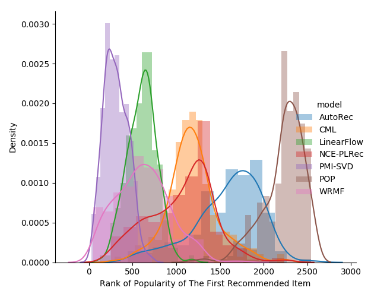

Noise-contrastive Estimation Projected LRec
====================================================


# About NCE-PLRec
In multi-stage recommendation frameworks(see our [RecSys Challenge repository](https://github.com/layer6ai-labs/vl6_recsys2018)), the first stage requires scalable algorithms that can process millions users and items in reasonable time and still maintain good performance(recall 90%+). Even over almost 10 years, WRMF is still the most reliable algorithm for such task(see [RecSys Leaderboard](https://recsys-challenge.spotify.com/static/final_main_leaderboard.html)). Despite its good performance, the computation is too expensive and slow. Thus, we introduce a fast linear recommendation algorithm called NCE-PLRec to replace WRMF in large scale recommendation tasks. 

# Algorithm Implemented
1. Noise-contrastive Estimation Projected LRec(NCE-PLRec)
2. Linear FLow or Projected LRec(PLRec)
3. Collaborative Metric Learning(CML)
4. Auto-encoder Recommender(AutoRec)
5. Weighted Regularized Matrix Factorization(WRMF)
6. PureSVD Recommender
7. Item-Item Similarity*
8. Popularity

# Measure
The above algorithm could be splitted into two major category based on the distance
measurement: Euclidean or Cosine. CML is a euclidean distance recommender. And, ALS 
is a typical Cosine distance recommender. When doing evaluation, please select 
similarity measurement before running with `--similarity Euclidean` 

# Data
1. Movielens 1M,
2. Movielens 20M,
3. Yahoo 1R,
4. Netflix,
5. Amazon Prize,
6. and
7. Spotify RecSys 2018 Competition Dataset.

Data is not suit to submit on github, so please prepare it yourself. It should be numpy npy file directly 
dumped from csr sparse matrix. It should be easy.. 

# Command for Movielens 1M
Process data
```
python getmovielens.py --implicit -r 0.5,0.2,0.3 -d /NCE_Projected_LRec/datax/ \
-n ml-1m/ratings.csv --shape 6041 3953

```

Run Weighted NCE-PLRec
```
$ python main.py -i 4 -l 1.0 -r 100 -a 10 -m NCE-PLRec -d datax/ \
-t Rtrain.npz -v Rvalid.npz -k 10
```

# Run-time
The proposed NCE-PLRec model needs only 3 mins to process MovieLens 20M!

# Example Result
Note: reproduce this result is easy, but you need to tune the hyperparameter alpha to
see the improvement, since for even same dataset, the split of the dataset could cause
huge difference of the hyper-parameter requirement. We suggest to use 50% of the training
data to train and validation on the others. We also suggest to apply small alpha in order
to avoid poor generalization issue.

 
```
================================================================================
|                              Parameter Setting                               |
================================================================================

Data Path: datax/
Train File Name: Rtrain.npz
Valid File Name: Rvalid.npz
Algorithm: PLRec
Mode: Item-based
Alpha: 10
Rank: 100
Lambda: 1.0
SVD Iteration: 4
Evaluation Ranking Topk: 10
================================================================================
|                                 Loading Data                                 |
================================================================================

Elapsed: 00:00:00
Train U-I Dimensions: (6041, 3953)
================================================================================
|                                Randomized SVD                                |
================================================================================

Elapsed: 00:00:01
================================================================================
|                          Create Cacheable Matrices                           |
================================================================================

Elapsed: 00:00:00
================================================================================
|                           Item-wised Optimization                            |
================================================================================

100%|██████████████████████████████████████| 3953/3953 [00:17<00:00, 223.06it/s]
Elapsed: 00:00:17
================================================================================
|                               Save U-V Matrix                                |
================================================================================

Elapsed: 00:00:00
================================================================================
|                                Create Metrics                                |
================================================================================

100%|██████████████████████████████████████| 6041/6041 [00:08<00:00, 694.76it/s]
-
NDCG :0.182108679494
R-Precision :0.078431372549
Clicks :0.0
Elapsed: 00:00:08

```

# Popularity Analysis
 <!-- .element height="50%" width="50%" -->

